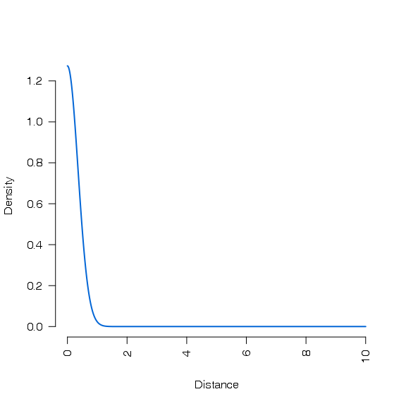
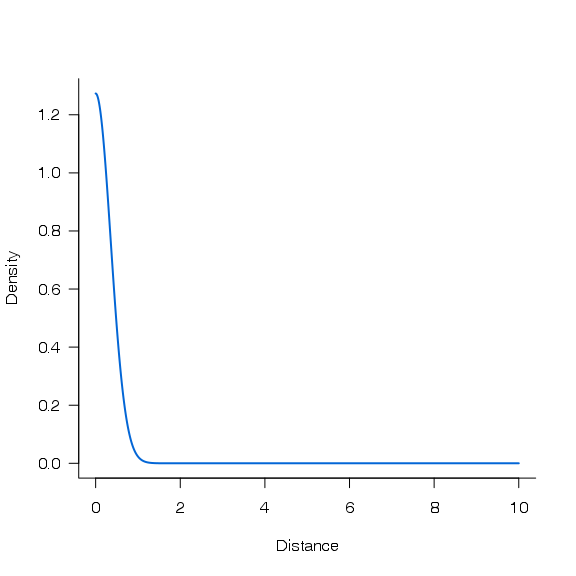
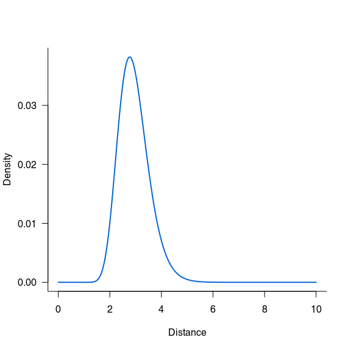

recruitR
--------

**'recruitR'**: A R package including useful functions for tree recruitment analyses.

At this stage, 5 common seeds isotropic dispersal kernels are implemented, they were selected Nathan et al. (2012).

    ## Loading recruitR

Current status
--------------

Last 'README' update: 2017-11-02

[](https://travis-ci.org/KevCaz/recruitR) [](https://ci.appveyor.com/project/KevCaz/recruitr/build/1.0.7) [](https://codecov.io/gh/KevCaz/recruitR)

Using the package
=================

Installation
------------

To get the current development version from Github using R, use the [*devtools*](http://cran.r-project.org/web/packages/devtools/index.html) package:

``` r
if (!require("devtools'")) install.packages("devtools")
devtools::install_github("KevCaz/recruitR")
library(recruitR)
```

Examples
--------

### Using a kernel

A simple call to one on the kernel:

``` r
kern_gaussian(4, 3)
R>> [1] 0.005977623
```

### Figure

1.  Gaussian kernel:

``` r
seqx <- seq(0,10,0.001)
par(las=2, bty='n')
plot(seqx, kern_gaussian(seqx, .5), type='l', lwd=2, col='#0366d6', xlab='Distance', ylab='Density')
```



1.  Log\_normal kernel:

``` r
plot(seqx, kern_lognormal(seqx, 3, .2), type='l', lwd=2, col='#0366d6', xlab='Distance', ylab='Density')
```



1.  Exponential\_power kernel:

``` r
plot(seqx, kern_exponential_power(seqx,2,3), type='l', lwd=2, col='#0366d6', xlab='Distance', ylab='Density')
```



References
----------

1.  Nathan, R., Klein, E., Robledo-Arnuncio, J. J. & Revilla, E. in Dispersal Ecology and Evolution 186–210 (Oxford University Press, 2012). [doi:10.1093/acprof:oso/9780199608898.003.0015](https://doi.org/10.1093/acprof:oso/9780199608898.003.0015)
